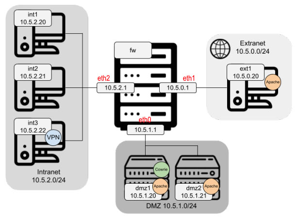

# Práctica DMZ - Sistemas Confiables

_Práctica 1 de la asignatura **Sistemas confiables** del máster universitario de investigación en Ciberseguridad de la Universidad de León_

## Author: Yoana Pita Lorenzo

## Objetivo de la práctica

Se pretende construir una DMZ (utilizando contenedores Docker para simular las máquinas) siguiendo la topología de red de la Figura 1 y atendiendo los siguientes criterios:



_Figura 1: Estructura de la DMZ_

## Archivos 📦

```
.
├── dmz
│   ├── dmz1
│   │   ├── Dockerfile           # Dockerfile para construir la imagen de la DMZ
│   │   └── start.sh             # Script para iniciar la DMZ    
│   └── dmz2
│       ├── Dockerfile           # Dockerfile para construir la imagen de la DMZ
│       └── start.sh             # Script para iniciar la DMZ    
├── docker-compose.yml           # Archivo de configuración de Docker Compose
├── extranet
│   ├── Dockerfile               # Dockerfile para la imágen de la Extranet
│   └── start.sh                 # Script para iniciar la Extranet
├── fw
│   ├── Dockerfile               # Dockerfile para la imágen del Firewall
│   ├── iptable.sh               # Script para configurar el Firewall  
│   └── start.sh                 # Script para iniciar el Firewall
├── img
│   └── Practica_DMZ_1.jpg       # Imagen de la topología de red
├── intranet
│   ├── int12
│   │   ├── Dockerfile           # Dockerfile para la imágen de la Intranet
│   │   └── start.sh             # Script para iniciar la Intranet
│   └── int3
│       ├── Dockerfile           # Dockerfile para la imágen de la Intranet con VPN
│       └── start.sh             # Script para iniciar la Intranet con VPN
└── README
